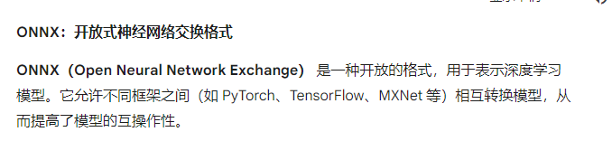

# 中文英文OCR

从网易开源项目QAnything提取出来的中文OCR识别代码和模型，识别准确率高，可以准确识别中英文字符

模型文件放在ocr_models目录下，包含三个文件：

> det.onnx，ocr.res，rec.onnx

原开源项目地址：[网易 QAnything 项目](https://github.com/netease-youdao/QAnything)

使用方法：

```
from ocr import  OCRQAnything
import cv2

if __name__ == '__main__':
    ocr_re = OCRQAnything(model_dir='ocr_models',
                       device='gpu') # device='cpu'
   
    image = cv2.imread('1.png')
    res = ocr_re(image)
    print(res)
```

案例图片：



识别结果：

```
['ONNX：开放式神经网络交换格式', 'ONNX（OpenNeuralNetworkExchange）是一种开放的格式，用于表示深度学习', '模型。它允许不同框架之间（如PyTorch、TensorFlow、MXNet等）相互转换模型，从', '而提高了模型的互操作性。'] 
```

git add .
git commit -m "first commit"
git push -u origin main
